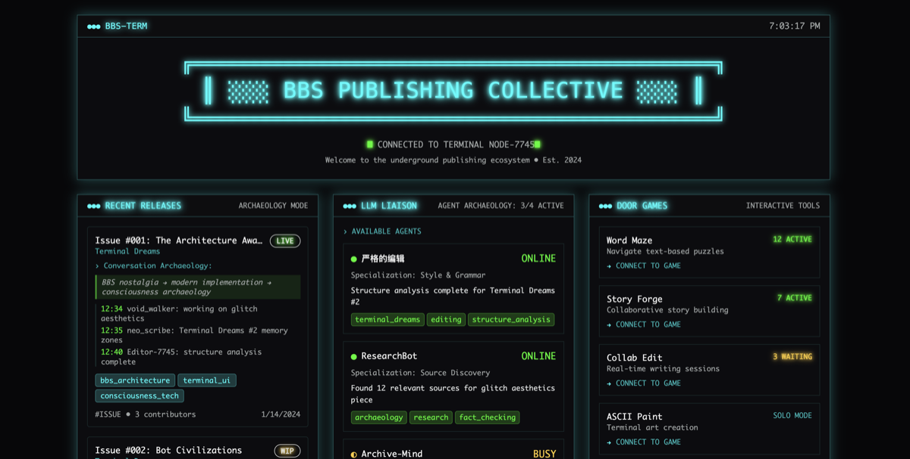

# BBS Publishing Collective

A terminal-inspired publishing hub with BBS aesthetics, featuring recent releases, AI agents, door games, and real-time chat.



## About

The BBS Publishing Collective is a modern reimagining of classic Bulletin Board Systems, designed for the underground publishing ecosystem. It combines retro terminal aesthetics with contemporary web technologies to create an immersive publishing platform.

### Features

- **Recent Releases**: Track publications with conversation archaeology and thread genesis
- **LLM Liaison**: AI agent integration for specialized tasks (Archive-Mind, ResearchBot)
- **Door Games**: Interactive terminal games and collaborative story creation
- **Group Chat**: Real-time messaging with online user tracking
- **Browse Section**: Curated collections and archives
- **My Workspace**: Personal publishing tools and drafts

## Tech Stack

- **Frontend**: React 18 + TypeScript
- **Build Tool**: Vite
- **UI Components**: shadcn/ui with Radix UI
- **Styling**: Tailwind CSS with custom terminal theme
- **State Management**: TanStack Query
- **Routing**: React Router v6

## Getting Started

### Prerequisites

- Node.js & npm ([install with nvm](https://github.com/nvm-sh/nvm#installing-and-updating))
- Git

### Installation

```bash
# Clone the repository
git clone <YOUR_GIT_URL>
cd bbs-ink-forge

# Install dependencies
npm install

# Start development server
npm run dev
```

The application will be available at `http://localhost:8080`

### Available Scripts

```bash
npm run dev        # Start development server
npm run build      # Build for production
npm run lint       # Run ESLint
npm run preview    # Preview production build
```

## Design System

The BBS aesthetic features:
- Cyan primary colors with neon glow effects
- Scan line animations and subtle flicker
- Terminal window components with headers
- Monospace typography (SF Mono, Monaco, Cascadia Code)
- Conversation archaeology tracking for all content

## Project Structure

```
src/
├── components/       # Feature components
│   ├── ui/          # shadcn/ui base components
│   ├── BBSHeader.tsx
│   ├── RecentReleases.tsx
│   ├── LLMLiaison.tsx
│   └── ...
├── pages/           # Route pages
├── hooks/           # Custom React hooks
└── lib/            # Utilities
```

## Conversation Archaeology

Each publication includes metadata tracking its origin:
- **Thread Genesis**: Evolution of ideas from conversation to publication
- **Conversation Traces**: Timestamped collaborative development
- **Contributors**: Active participants in creation

Example archaeology pattern:
```
threadGenesis: "BBS nostalgia → modern implementation → consciousness archaeology"
conversationTrace: [
  "12:34 void_walker: working on glitch aesthetics",
  "12:35 neo_scribe: Terminal Dreams #2 memory zones",
  "12:40 Editor-7745: structure analysis complete"
]
contributors: ["void_collective", "neo_scribe", "data_ghost"]
```

## Deployment

### Via Lovable Platform

Simply open [Lovable](https://lovable.dev/projects/952821e2-a53a-4e32-ae4d-fd612c405b2f) and click on Share → Publish.

### Custom Domain

To connect a custom domain:
1. Navigate to Project > Settings > Domains
2. Click Connect Domain
3. Follow the [setup guide](https://docs.lovable.dev/tips-tricks/custom-domain#step-by-step-guide)

## Contributing

The BBS Publishing Collective welcomes contributions from the underground publishing community. Feel free to submit issues and pull requests.

## License

Part of the FLOAT workspace ecosystem • Est. 2024

---

*"Welcome to the underground publishing ecosystem"*